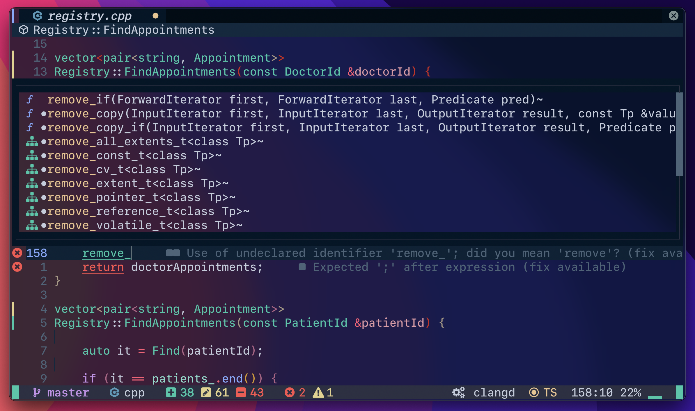

# My dotfiles 💾

**WARNING:** Don't blindly use my settings. Proceed at your own risk!

# Terminal Setup
- [iTerm2](https://iterm2.com/) - iTerm2 is a replacement for Terminal and the successor to iTerm.
- [Oh My Zsh](https://ohmyz.sh/) - Oh My Zsh is an open source, community-driven framework for managing your Zsh configuration.
- [zsh-syntax-highlighting](https://github.com/zsh-users/zsh-syntax-highlighting) - Fish shell like syntax highlighting for Zsh.
- [zsh-autosuggestions](https://github.com/zsh-users/zsh-autosuggestions) - Fish-like autosuggestions for Zsh
- [SFMono-Nerd-Font-Ligaturized](https://github.com/shaunsingh/SFMono-Nerd-Font-Ligaturized) - Apple's SFMono font nerd-font patched and ligaturized

### Relevant files
- [.zshrc](.zshrc) - Zsh Shell Configuration

# Tmux Setup
- [tpm](https://github.com/tmux-plugins/tpm) - Tmux Plugin Manager
- [vim-tmux-navigator](https://github.com/christoomey/vim-tmux-navigator) - Seamless navigation between tmux panes and vim splits
- [tmux-resurrect](https://github.com/tmux-plugins/tmux-resurrect) - Persists tmux environment across system restarts.
- [tmux-continuum](https://github.com/tmux-plugins/tmux-continuum) - Continuous saving of tmux environment.
- [tmux-sessionist](https://github.com/tmux-plugins/tmux-sessionist) - Lightweight tmux utils for manipulating sessions
- [tmux-themepack](https://github.com/jimeh/tmux-themepack) - A pack of various Tmux themes. 

### Relevant files
- [.tmux.conf](.tmux.conf) - Tmux Configuration File

# Neovim setup
I use [AstroNvim](https://github.com/AstroNvim/AstroNvim) - is an aesthetic and feature-rich neovim config that is extensible and easy to use with a great set of plugins

**NOTE:** Please read the [requirements](https://github.com/AstroNvim/AstroNvim#-requirements) for correct installation.

### Relevant files
- [.config/nvim/lua/user](.config/nvim/lua/user) - My user config
