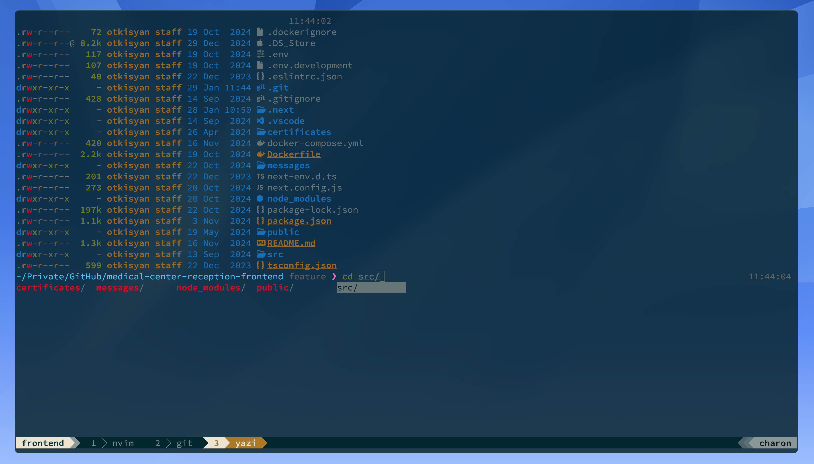

# My dotfiles...




## Setup

[](https://github.com/otkisyan/dotfiles/actions/workflows/macos.yml)

### Prerequisites

- Xcode Command Line Tools
- Homebrew

To set up the dotfiles run the appropriate snippet in the terminal:

```bash
bash -c "$(curl -LsS https://raw.githubusercontent.com/otkisyan/dotfiles/master/scripts/setup.sh)"
```

**DON'T** run the setup script if you don't understand [what it does](scripts/setup.sh). Proceed at your own risk!

## Terminal Setup

- [kitty](https://github.com/kovidgoyal/kitty) - Cross-platform, fast, feature-rich, GPU based terminal
- [Oh My Zsh](https://ohmyz.sh/) - Oh My Zsh is an open source, community-driven framework for managing your Zsh configuration
- [zsh-syntax-highlighting](https://github.com/zsh-users/zsh-syntax-highlighting) - Fish shell like syntax highlighting for Zsh
- [zsh-autosuggestions](https://github.com/zsh-users/zsh-autosuggestions) - Fish-like autosuggestions for Zsh
- [powerlevel10k](https://github.com/romkatv/powerlevel10k) - A theme for Zsh, it emphasizes speed, flexibility and out-of-the-box experience
- [SauceCodePro Nerd Font](https://www.nerdfonts.com/font-downloads) - Monospaced font family for user interface and coding environments
- [Exa](https://github.com/ogham/exa) - A modern replacement for `ls`

### Relevant files

- [.zshrc](./src/.zshrc) - Zsh Shell Configuration
- [.config/kitty](./src/.config/kitty/) - Kitty Configuration 

## Tmux Setup

- [tpm](https://github.com/tmux-plugins/tpm) - Tmux Plugin Manager
- [vim-tmux-navigator](https://github.com/christoomey/vim-tmux-navigator) - Seamless navigation between tmux panes and vim splits
- [tmux-resurrect](https://github.com/tmux-plugins/tmux-resurrect) - Persists tmux environment across system restarts
- [tmux-continuum](https://github.com/tmux-plugins/tmux-continuum) - Continuous saving of tmux environment
- [tmux-sessionist](https://github.com/tmux-plugins/tmux-sessionist) - Lightweight tmux utils for manipulating sessions

### Relevant files

- [.tmux.conf](./src/.tmux.conf) - Tmux Configuration

## Neovim setup

I use [AstroNvim](https://github.com/AstroNvim/AstroNvim) - an aesthetic and feature-rich neovim config that is extensible and easy to use with a great set of plugins

- [Solarized Osaka](https://github.com/craftzdog/solarized-osaka.nvim) - A clean, dark Neovim theme written in Lua, with support for lsp, treesitter and lots of plugins.

### Relevant files

- [.config/nvim](./src/.config/nvim) - AstroNvim Configuration
